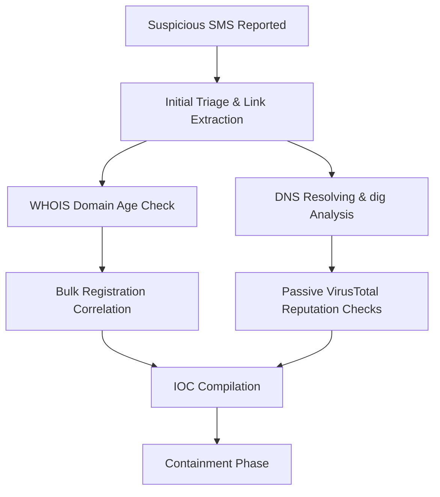

# Incident Response Methodology: Smishing Investigation

This document outlines the standard operating procedure and investigative methodology applied during the analysis of the coordinated smishing campaign. The framework aligns with the **SANS Incident Response Process**.

---

## 1. Phase: Preparation
Before an incident occurs, capabilities, tools, and access controls are established.
- **Analysis Environment**: Standard sandboxed VMs (e.g., Kali Linux) were utilized. The analysis environment was routed through external threat-analysis gateways to prevent exposing internal infrastructure footprints.
- **Forensic Utilities**: Prepared tools including `whois`, `nslookup`, `dig`, and `curl`, alongside secure API integrations for VirusTotal and urlscan.io.
- **User Training**: Deployed communication channels permitting mobile users to report suspicious SMS messages and banking alerts immediately.

---

## 2. Phase: Identification (Triage & Analysis)
Detecting the threat and determining its scope and technical details.

1. **SMS Analysis**: Examined sender templates, financial lures, and primary URL links.
2. **WHOIS Reconnaissance**:
   - Analyzed domain registration age and identified registration correlation (domains registered within a 12-second window).
   - Inspected registrar reuse (Spaceship, Inc.) and nameserver sharing (`aron.ns.cloudflare.com` / `josh.ns.cloudflare.com`).
3. **DNS Infrastructure Mapping**:
   - Performed resolutions using `nslookup` and `dig` to confirm active operational status.
   - Identified Cloudflare IP fronting (`104.21.x.x` and `172.67.x.x` ranges).
4. **Behavioral Footprint Checking**:
   - Inspected HTTP responses using `curl` and urlscan.io, capturing the `204 No Content` server status indicating anti-sandbox or user-agent-based payload delivery.
   - Checked VirusTotal for reputation classifications (identifying ESET phishing detections).

---

## 3. Phase: Containment
Preventing the threat from spreading or executing further.
- **Short-Term Containment**:
  - Implemented boundary DNS blocks on internal resolvers for the domains `xm87.xyz`, `nd33.xyz`, `re13.xyz`, and `lk94.top`.
  - Configured Secure Web Gateway (SWG) filters targeting outbound requests to newly registered domains returning HTTP 204 codes via Cloudflare.

---

## 4. Phase: Eradication
Removing the root cause of the incident.
- **Registrar Escalation**: Sent abuse complaints to Spaceship, Inc. outlining malicious bulk domain setups and TOS violations.
- **Proxy Mitigation**: Reported indicators to Cloudflare to restrict proxying and trigger block warning screens for incoming user connections.

---

## 5. Phase: Recovery
Restoring normal operations safely.
- **Verification**: Verified that external DNS lookups for the target domains return suspension codes or block pages.
- **Monitoring**: Checked proxy logs for historical outbound lookups to confirm if any internal clients initiated requests to the target domains during the active campaign phase.

---

## 6. Phase: Lessons Learned
Reviewing the incident to improve future response posture.
- **Refinement**: Implement network access restrictions for low-cost, high-abuse TLDs (`.xyz`, `.top`) when domains are newly registered (less than 30 days old).
- **Detection Engineering**: Deploy rules flagging patterns of bulk domain registrations matching similar naming structures within short timeframes.

